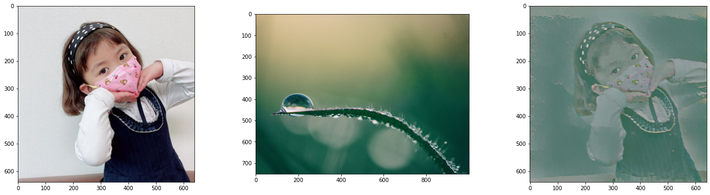
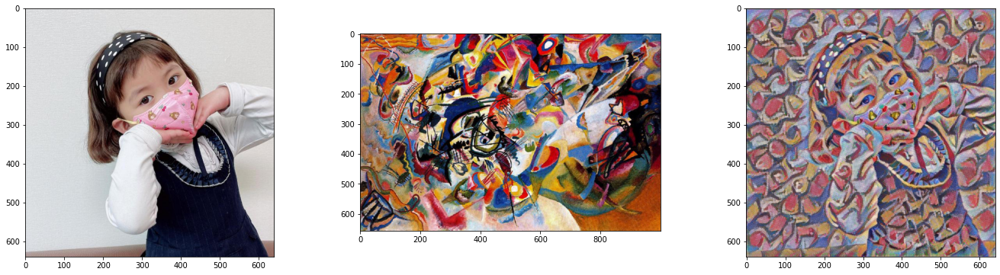

# Neural Style Transfer

Neural style transfer is an optimization technique used to take two images, a content image, a style reference image (such as an artwork by a famous painter), and the input image you want to style — and blend them together such that the input image is transformed to look like the content image, but “painted” in the style of the style image.

## Example

* First image of row : Content image
* Second image of row : Style reference image
* Third image of row : Resutant image

  

 

  

